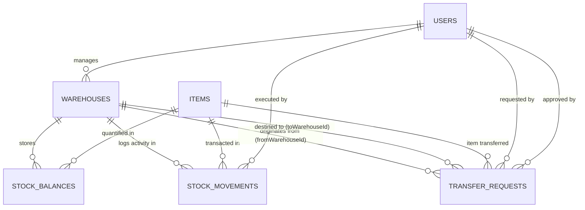

# MedEx PharmaGrid — Multi-Warehouse Pharmaceutical & Cold-Chain Logistics Network
**Christ University • 5th Semester • Advanced JavaScript (CIA-3 Project)**  
**Topic:** P11 — Warehouse & Inventory Management System (Domain: Healthcare, Pharma & Cold-Chain Supply Chain)

---

## 📌 1. Project Title & Team Details

* **Project Title**: MedEx PharmaGrid — National Pharmaceutical & Cold-Chain Logistics Grid
* **Course**: Advanced JavaScript (CIA 3)
* **Semester / Department**: 5th Semester, Computer Science, Christ University
* **Team Members & Module Ownership**:
  * **Shreya Sunil Morajkar** — Backend Architecture, Database Schema Design, User Registration & Authentication (JWT/Bcrypt), Warehouse Management Module, Item/SKU Master Catalog & Inbound Stock Engine.
  * **Shreya V Nair** — Stock-Out Recording Engine, Real-Time Running Stock Balance Aggregation, Inter-Warehouse Transfer Request Engine & Multi-Step Approval State Machine.
  * **Sarah Mariam Rajesh** — Low-Stock & Reorder Point Alert Subsystem, Physical Count Stock Audit & Discrepancy Adjustments, Immutable Movement Audit Ledger.
  * **Sanjana N Kothwal** — Manager & Admin Financial Valuation & Turnover Reports, Granular Role-Based Access Control (RBAC), Automated Integration Test Suite, Interactive Web Dashboard & Technical Documentation.

---

## 🏥 2. Problem Statement & Domain Context

Pharmaceutical and clinical distribution networks face strict operational mandates regarding temperature-sensitive biologicals (e.g., vaccines, insulin), batch expiration tracking, regulatory compliance, and cross-facility stock allocation across manufacturing hubs, central bio-vaults, and regional hospital fulfillment depots. 

Unmonitored logistics cause cold-chain temperature excursions, drug shortages during medical emergencies, batch spoilage, and stock discrepancies.

**MedEx PharmaGrid** solves this by delivering an enterprise-grade multi-facility inventory tracking backend. It maintains real-time running stock balances per warehouse, enforces cold-chain temperature qualification (2°C - 8°C vs Ambient) and storage capacities, coordinates multi-stage inter-warehouse transfers (`PENDING` $\rightarrow$ `APPROVED` $\rightarrow$ `IN_TRANSIT` $\rightarrow$ `COMPLETED`), alerts inventory managers of critical low-stock thresholds, and maintains an immutable audit ledger for complete batch genealogy and regulatory compliance.

---

## 🛠️ 3. Tech Stack Used

* **Backend Runtime**: Node.js (v18+)
* **Web Framework**: Express.js (MVC Architecture)
* **Database & ODM**: MongoDB with Mongoose (Compound Indexes, Schema Validation, Atomic Updates)
* **Security & Auth**: JSON Web Tokens (JWT) + `bcryptjs` password hashing + Granular RBAC Middleware
* **Input Validation**: `express-validator` with centralized JSON error mapping
* **Logging & Middleware**: Morgan HTTP Logger, CORS, Centralized Error Handler
* **Frontend Demo UI**: Vanilla JavaScript (ES6+), HTML5, CSS3 Glassmorphism UI, FontAwesome
* **Testing & Documentation**: Automated Test Suite (`npm run test:api`) and Postman Collection v2.1

---

## 🌐 4. Multi-Warehouse Supply Chain Topology

MedEx PharmaGrid models a nationwide cold-chain and clinical distribution grid:

| Facility Code | Facility Name | Facility Type | Capacity | Temperature Spec |
|---|---|---|---|---|
| `WH-HYD-01` | **Hyderabad Central Manufacturing & Bulk Depot** | Central Hub | 25,000 units | Ambient (15°C - 25°C) |
| `WH-MAA-02` | **Chennai Cold-Chain Bio-Vault** | Cold Chain | 15,000 units | Cold-Chain (2°C to 8°C / Ultra-Cold -20°C) |
| `WH-DEL-03` | **Delhi NCR Northern Distribution Center** | Regional Depot | 18,000 units | Ambient (15°C - 25°C) |
| `WH-CCU-04` | **Kolkata Eastern Regional Logistics Depot** | Regional Depot | 12,000 units | Ambient (15°C - 25°C) |

---

## 📋 5. The 13 Mandatory Functional Modules

| # | Module Name | Implementation Summary | Primary Endpoints |
|---|---|---|---|
| **1** | **User Registration & Authentication** | JWT-based auth with bcrypt-hashed passwords and facility affiliation. | `POST /api/auth/register`<br>`POST /api/auth/login`<br>`GET /api/auth/me` |
| **2** | **Warehouse Management** | Facility CRUD, capacity tracking, cold-chain qualification, and live utilization calculation. | `GET /api/warehouses`<br>`POST /api/warehouses`<br>`PUT /api/warehouses/:id` |
| **3** | **Item/SKU Master Management** | Catalog management for vaccines, antibiotics, critical care fluids, and medical devices. | `GET /api/items`<br>`POST /api/items`<br>`PUT /api/items/:id`<br>`DELETE /api/items/:id` |
| **4** | **Stock-In Recording** | Inbound manufacturing receipt with batch lot numbers and facility capacity checks. | `POST /api/stock/in` |
| **5** | **Stock-Out Recording** | Outbound hospital/clinic dispatches with strict negative balance prevention. | `POST /api/stock/out` |
| **6** | **Running Stock Balance Engine** | Atomic per-facility per-SKU balance lookups using compound indexes (`{ warehouseId: 1, itemId: 1 }`). | `GET /api/stock/balance` |
| **7** | **Inter-Warehouse Transfer Requests** | Staff submits stock transfer requests from source to destination facility. | `POST /api/transfers`<br>`GET /api/transfers` |
| **8** | **Transfer Approval Workflow** | Multi-step state machine: `PENDING` $\rightarrow$ `APPROVED`/`REJECTED` $\rightarrow$ `IN_TRANSIT` $\rightarrow$ `COMPLETED`. | `PUT /api/transfers/:id/decision`<br>`PUT /api/transfers/:id/dispatch`<br>`PUT /api/transfers/:id/receive` |
| **9** | **Low-Stock Alert & Reorder Point** | Automatic threshold detection (`quantity <= reorderPoint / 4`) with suggested restock quantities. | `GET /api/reports/low-stock` |
| **10** | **Stock Audit / Adjustment Module** | Physical count reconciliation with mandatory reason codes (`DAMAGED_COLD_CHAIN`, `EXPIRED_LOT`, etc.). | `POST /api/stock/adjust` |
| **11** | **Movement History Log** | Immutable, chronological ledger of all stock transactions with before/after balances. | `GET /api/movements` |
| **12** | **Manager & Admin Reports** | Financial valuation ($Qty \times Price$), fast-moving turnover velocity, and facility utilization reports. | `GET /api/reports/valuation`<br>`GET /api/reports/fast-moving`<br>`GET /api/reports/warehouse-utilization` |
| **13** | **Role-Based Access Control (RBAC)** | Granular route guards for `ADMIN`, `MANAGER`, and `STAFF`. | Middleware: `authorize(['ADMIN', ...])` |

---

## 🗄️ 6. MongoDB Schema Design & Relationships



---

## ⚡ 7. Installation & Quick Start

### Prerequisites
* **Node.js**: Version 18.0.0 or higher
* **MongoDB**: Local MongoDB instance running on `mongodb://127.0.0.1:27017` or MongoDB Atlas URI in `.env`

### Step 1: Clone Repository & Install Dependencies
```bash
git clone https://github.com/ShreyaMorajkar/medex-pharmagrid-warehouse-system.git
cd medex-pharmagrid-warehouse-system
npm install
```

### Step 2: Configure Environment Variables
Create a `.env` file in the root directory (or use default values):
```env
PORT=5000
MONGODB_URI=mongodb://127.0.0.1:27017/medex_pharmagrid_db
JWT_SECRET=medex_super_secure_jwt_secret_key_2025_christ_university
JWT_EXPIRES_IN=7d
NODE_ENV=development
```

### Step 3: Seed Database
Populate the database with clinical warehouses, users, pharmaceutical SKUs, and stock balances:
```bash
npm run seed
```

### Step 4: Run Automated API Test Suite
Run the 23-point automated integration tests:
```bash
npm run test:api
```

### Step 5: Start Server & Launch Interactive Dashboard
```bash
npm start
```
Open your browser and navigate to: **`http://localhost:5000`**

---

## 👥 8. Demo User Credentials for Live Evaluation

| Role | Email | Password | Assigned Location |
|---|---|---|---|
| **ADMIN** | `admin@medex.com` | `Password123!` | Global Operations / Hyderabad Hub |
| **MANAGER** | `chennai.manager@medex.com` | `Password123!` | Chennai Cold-Chain Bio-Vault |
| **MANAGER** | `delhi.manager@medex.com` | `Password123!` | Delhi Regional Depot |
| **STAFF** | `hyd.staff@medex.com` | `Password123!` | Hyderabad Depot |
| **STAFF** | `kolkata.staff@medex.com` | `Password123!` | Kolkata Depot |

---

## 📮 9. Postman Collection
Import the collection located at:
`postman/MedEx_PharmaGrid.postman_collection.json` into Postman to test all endpoints.

---

## 📄 License & Academic Integrity
Developed for **Advanced JavaScript (CIA-3)**, Department of Computer Science, Christ University (2025-2026).
